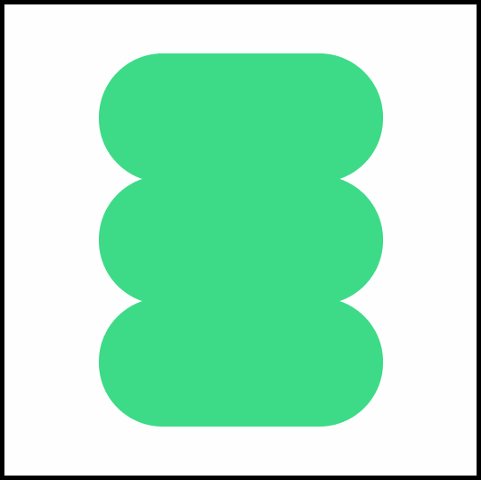

  

<h1 align="center">comfySpace</h1>

  
  
    

**`A comfortable interface for Raspberry Pi projects`**

**`Credit`**
 
<a href="https://iconscout.com/icons/space-dog" target="_blank">Free Space Dog  Icon</a> by <a href="https://iconscout.com/contributors/chanut-is-industries" target="_blank">Rafiico Creative</a> 
<a href="https://iconscout.com/icons/astronaut" target="_blank">Free Astronaut  Icon</a> by <a href="https://iconscout.com/contributors/chanut-is-industries">Rafiico Creative</a> on <a href="https://iconscout.com">IconScout</a> 
<a href="https://iconscout.com/icons/moon-surface" target="_blank">Free Moon Surface  Icon</a> by <a href="https://iconscout.com/contributors/chanut-is-industries" target="_blank">Rafiico Creative</a> 
<a href="https://iconscout.com/icons/solar-system" target="_blank">Free Solar System  Icon</a> by <a href="https://iconscout.com/contributors/chanut-is-industries">Rafiico Creative</a> on <a href="https://iconscout.com">IconScout</a> 
<a href="https://iconscout.com/icons/galaxy" target="_blank">Free Galaxy  Icon</a> by <a href="https://iconscout.com/contributors/chanut-is-industries" target="_blank">Rafiico Creative</a> 

### 🧰 Languages and Tools

 

