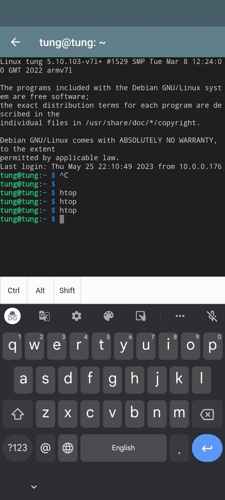
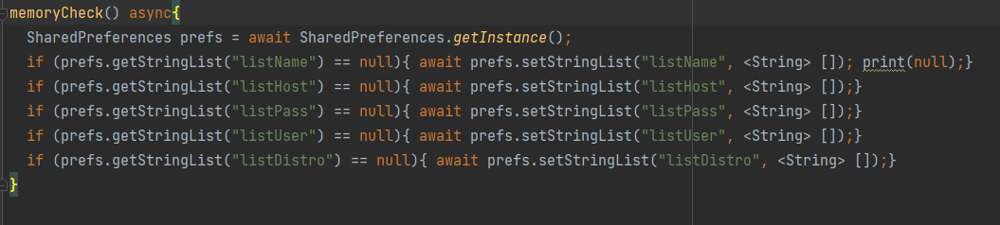
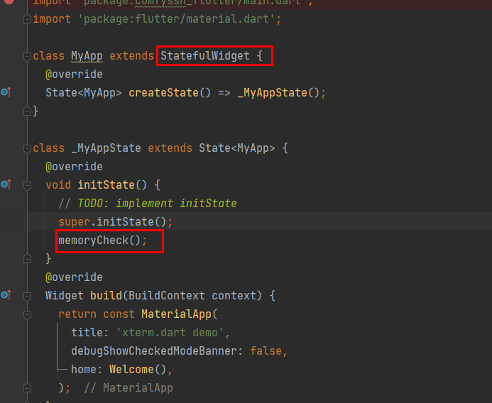
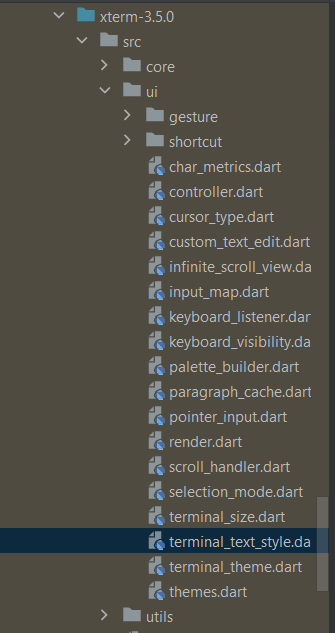

# comfyssh

A comfortable SSH application for both beginners & advanced users![]

Progress Update:
23.05.25:

I don't know how this worked but finally got Ctrl, Alt, and Shift working

23.05.30
Bug #1: If lists in memory is not present in the first place aka. first app boot, no info can be added
Solution: add memorycheck function to check if lists in memory are null, if so, create an empty list in such place, 

and make mainapp a stateful widget, and run memorycheck on init

Bug #2:
List tiles do not show up on first boot (after closing app), but only when hot reload on Android Studio or setState on app

Further improvement:
Making text copyable
